# TP01 - Bases Docker (Image, Dockerfile, Volume, Network, Docker Compose)

## 1. Objectifs

Ce TP a pour but de se familiariser avec:

- les images Docker;
- les `Dockerfile`;
- les volumes;
- les réseaux Docker;
- Docker Compose.

## 2. Prerequis

- Docker installe et demarre (`docker --version` doit repondre).
- Acces a un terminal Linux/macOS.
- Se placer dans le dossier de travail utilisateur (adapte avec ton username):

```bash
cd /home/<mon_user>
mkdir -p TP01
cd TP01
```

Verification:

```bash
pwd
ls -la
```

Capture d'ecran a faire:

- **Capture 01**: terminal montrant `pwd` dans `.../TP01` + `ls -la`.
- Placement dans le README: section **"3.1 Creation de l'environnement"**.

---

## 3. Etape par etape

### 3.1 Creation de l'environnement

Commandes:

```bash
mkdir -p app01
cd app01
```

Verification:

```bash
pwd
```

Capture d'ecran:

- **Capture 02**: `pwd` montrant `.../TP01/app01`.

Message de commit propose:

```text
chore: initialize TP01 workspace and app01 folder
```

### 3.2 Ajout de l'application Node.js

Creer `app.js`:

```js
'use strict';

const bluebird = require('bluebird');
const express = require('express');
const app = express();
const redis = require('redis');
const client = redis.createClient({ host: 'redis' });
const PORT = 8080;

bluebird.promisifyAll(redis.RedisClient.prototype);

app.get('/', (req, res) => {
  client.incrAsync('hits').then((result) => {
    res.send('Hello everyone! I have processed ' + result + ' requests.\n');
  });
});

app.listen(PORT);
console.log('Running on http://localhost:' + PORT);
```

Creer `package.json`:

```json
{
  "name": "compose-workshop",
  "version": "1.0.0",
  "description": "NodeJS App",
  "main": "app.js",
  "scripts": {
    "test": "echo \"Error: no test specified\" && exit 1"
  },
  "repository": {
    "type": "git",
    "url": "git+https://github.com/Inist-CNRS/compose-workshop.git"
  },
  "keywords": [
    "docker",
    "compose",
    "nodejs"
  ],
  "author": "Claude Niederlender <claude.niederlender@gmail.com>",
  "license": "ISC",
  "bugs": {
    "url": "https://github.com/Inist-CNRS/compose-workshop/issues"
  },
  "homepage": "https://github.com/Inist-CNRS/compose-workshop#readme",
  "dependencies": {
    "bluebird": "^3.4.0",
    "express": "^4.13.4",
    "redis": "^2.5.3"
  }
}
```

Verification:

```bash
ls -la
cat app.js
cat package.json
```

Capture d'ecran:

- **Capture 03**: arborescence `app01` avec `app.js` et `package.json`.

Message de commit propose:

```text
feat: add Node.js counter app source files
```

### 3.3 Lancement de Redis et creation du reseau Docker

Commandes:

```bash
docker run -d --name redis redis:latest
docker network create mon-net
docker network connect mon-net redis
```

Verifications:

```bash
docker ps
docker network ls
docker network inspect mon-net
```

Points a verifier:

- le container `redis` est `Up`;
- le reseau `mon-net` existe;
- `redis` apparait dans `Containers` du `docker network inspect`.

Capture d'ecran:

- **Capture 04**: resultat de `docker ps`.
- **Capture 05**: extrait de `docker network inspect mon-net` avec `redis` connecte.

Message de commit propose:

```text
docs: document Redis container and custom bridge network setup
```

### 3.4 Construction de l'image applicative

Creer `Dockerfile` dans `app01/`:

```dockerfile
FROM node:14.15.0-alpine

# Create the directory /usr/src/my-app
RUN mkdir -p /usr/src/my-app

# Change the current directory to /usr/src/my-app
WORKDIR /usr/src/my-app

# Copy the files to the current directory
COPY app.js .
COPY package.json .

# Execute the command: npm install
RUN npm install

EXPOSE 8080

CMD ["node", "app.js"]
```

Construire l'image:

```bash
docker build -t mesapps/app01 .
```

Verification:

```bash
docker images
```

Point a verifier:

- presence de `mesapps/app01` dans la liste des images.

Capture d'ecran:

- **Capture 06**: sortie de `docker build` (lignes de succes final).
- **Capture 07**: sortie de `docker images` avec `mesapps/app01`.

Message de commit propose:

```text
feat: add Dockerfile and build mesapps/app01 image
```

### 3.5 Deploiement du container applicatif

Commande:

```bash
docker run -d --name app01 --network mon-net -p 8080:8080 mesapps/app01
```

Verifications:

```bash
docker ps
curl http://localhost:8080
curl http://localhost:8080
```

Points a verifier:

- container `app01` en statut `Up`;
- `curl` repond avec:
  - premier appel: `... processed 1 requests`;
  - second appel: `... processed 2 requests`.

Capture d'ecran:

- **Capture 08**: `docker ps` montrant `redis` + `app01`.
- **Capture 09**: deux appels `curl` avec compteur qui incremente.

Message de commit propose:

```text
feat: run app01 container connected to redis on mon-net
```

### 3.6 Acces shell dans le container

Commandes:

```bash
docker container exec -it app01 /bin/sh
```

Puis dans le container:

```sh
pwd
ls -la
exit
```

Verification:

- confirmer qu'on est dans `/usr/src/my-app`;
- confirmer la presence de `app.js` et `package.json`.

Capture d'ecran:

- **Capture 10**: session shell dans `app01` avec `pwd` + `ls -la`.

Message de commit propose:

```text
docs: add container inspection step with docker exec
```

### 3.7 Nettoyage des ressources

Commandes:

```bash
docker rm -vf redis
docker rm -vf app01
docker network rm mon-net
```

Verification:

```bash
docker ps -a
docker network ls
```

Point a verifier:

- `redis` et `app01` n'apparaissent plus;
- `mon-net` n'apparait plus.

Capture d'ecran:

- **Capture 11**: verification finale (`docker ps -a` + `docker network ls`).

Message de commit propose:

```text
chore: clean docker containers and custom network
```

---

## 4. Emplacement des captures dans le repo

Stocker toutes les captures dans:

```text
images/
```

Nommage recommande:

```text
images/01-workspace.png
images/02-app01-folder.png
images/03-node-files.png
images/04-docker-ps-redis.png
images/05-network-inspect.png
images/06-docker-build.png
images/07-docker-images.png
images/08-docker-ps-app.png
images/09-curl-counter.png
images/10-exec-shell.png
images/11-cleanup.png
```

Insertion markdown type:

```md

```

---

## 5. Checklist de rendu (qualite maximale)

- Toutes les commandes du TP sont presentes et executables.
- Chaque commande importante a une verification associee.
- Les captures montrent bien les preuves de fonctionnement.
- Les noms de fichiers/images sont coherents.
- Les commits sont clairs et atomiques (une etape = un commit).
- Le README permet a une autre personne de rejouer le TP sans aide externe.


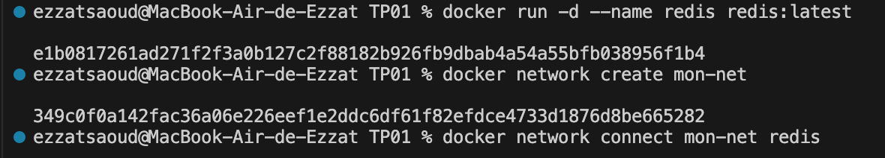

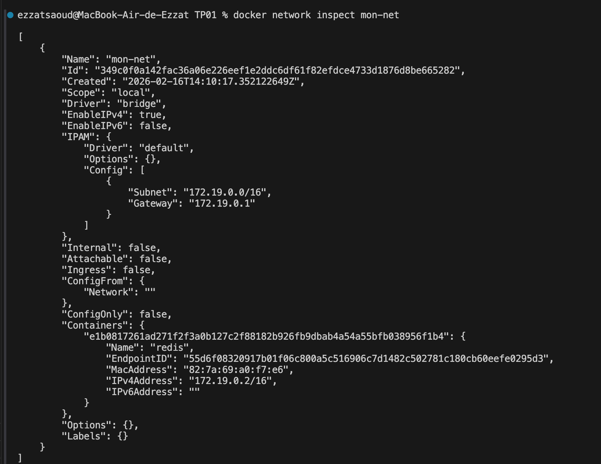

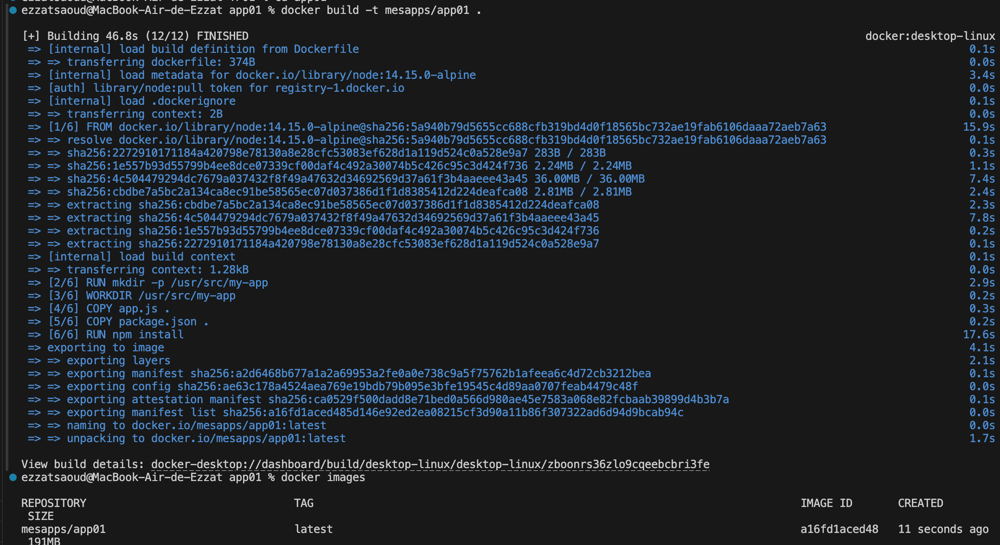

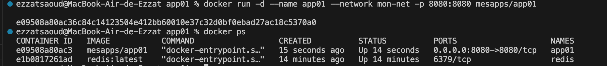

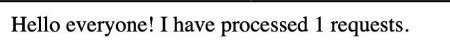

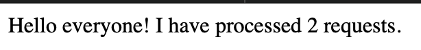

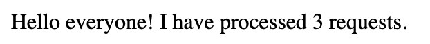

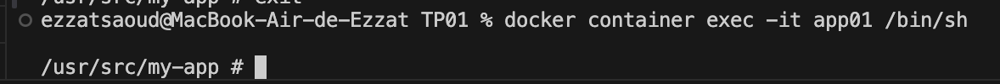

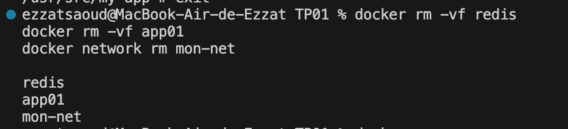

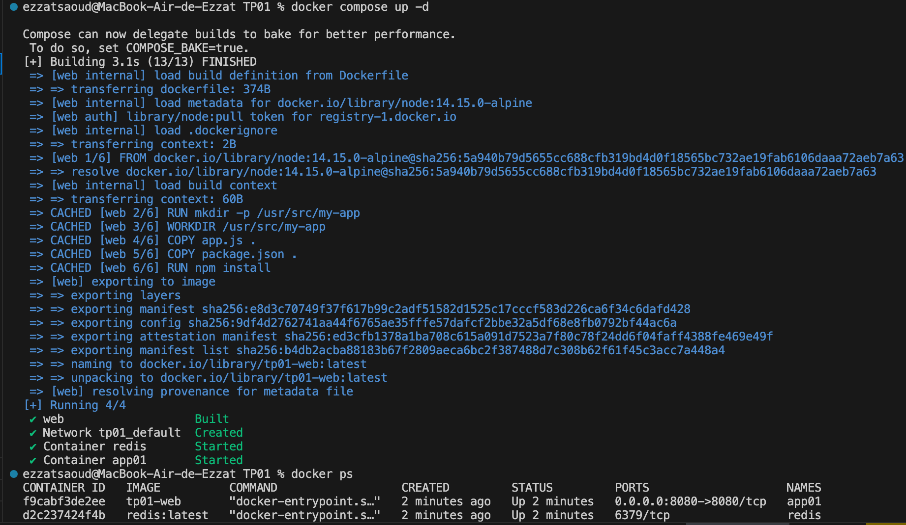

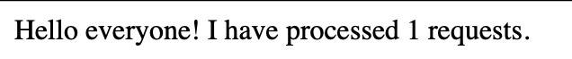

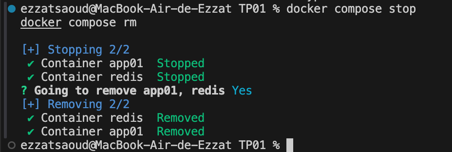

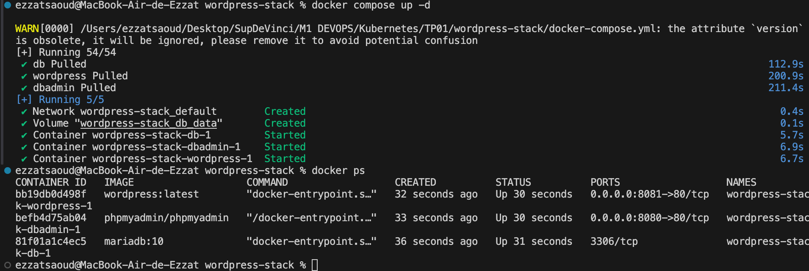

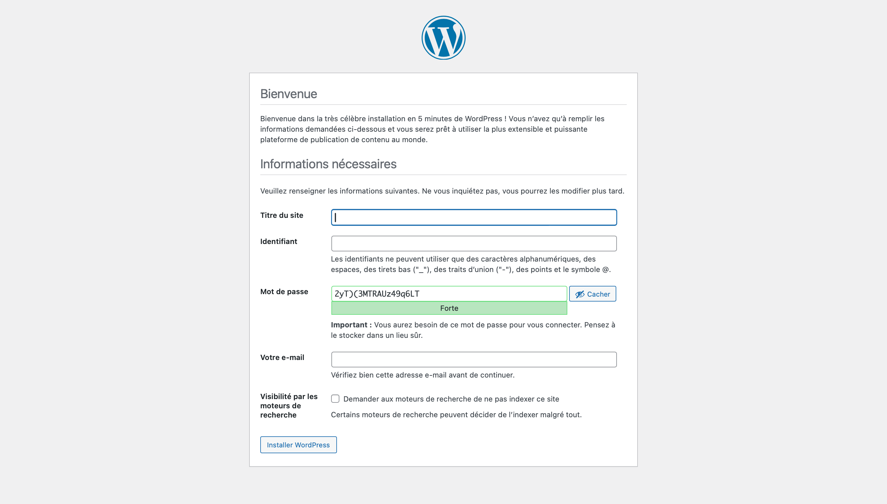

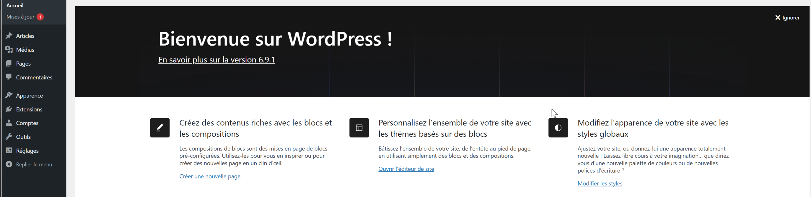

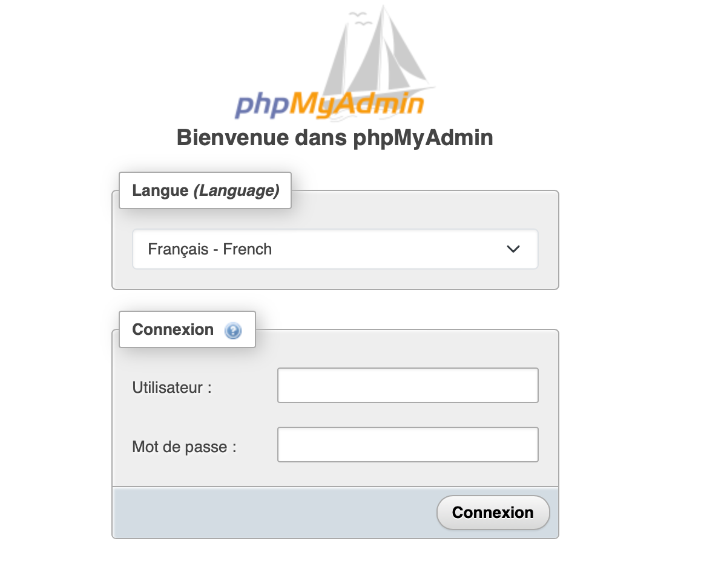

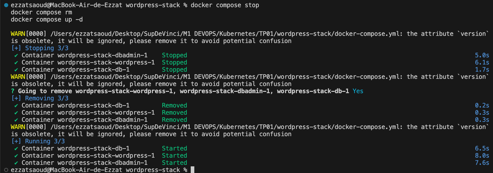

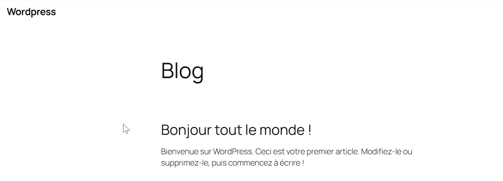